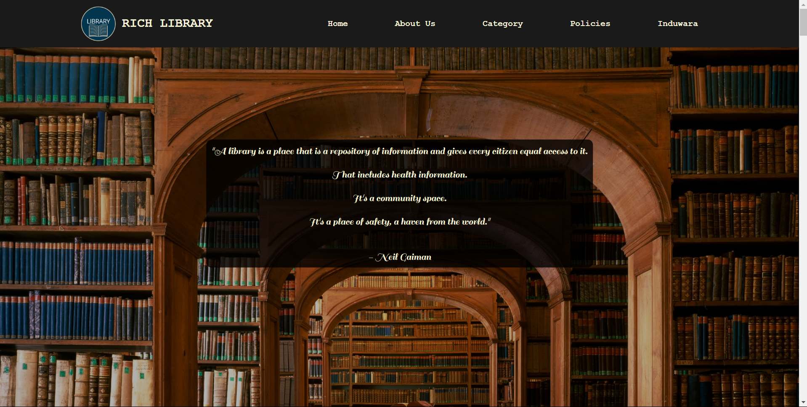
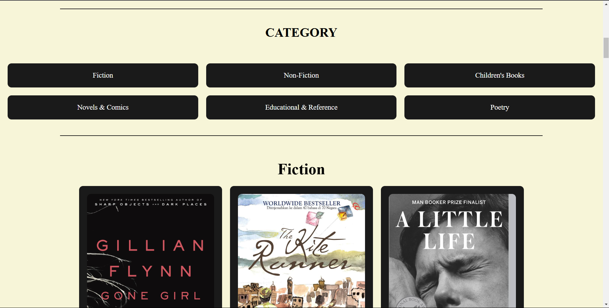
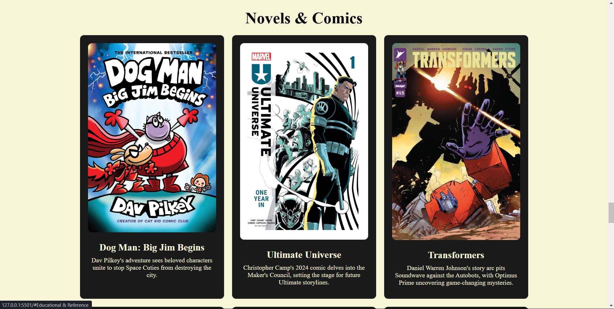
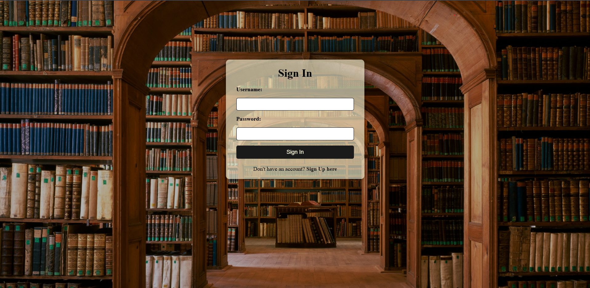

# Library Website - Prototype 📚🌐

This project was developed as part of an assessment for the Web Developer course provided by the **Open Learning Platform - University of Moratuwa**. It represents a simple library website prototype where users can browse books available in the library and log in to the system. The website is designed to be user-friendly while showcasing essential features of modern web applications. 

---

## Features 🌟💻
- 📚 **Browse Books**: Users can explore a wide variety of books categorized by genre, making it easy to find their next read.
- 🔐 **Login System**: A basic login functionality is implemented for user authentication, ensuring a personalized experience for users.

---

## Tools and Technologies Used 🛠️📋🖥️
- 💻 **JavaScript**: Handles dynamic interactions and functionality, enabling features like filtering books and managing user actions.
- 📝 **HTML**: Structures the content of the website, ensuring accessibility and clarity.
- 🎨 **CSS**: Styles the website for an enhanced user experience, with visually appealing layouts and responsive elements.

---

## Project Structure 📂📜📚
- 📄 **index.html**: The main page that displays the book categories and serves as the entry point for users.
- 📜 **config.js**: Contains JavaScript code the files that should initialize before the system run
- 🎨 **styles.css**: Provides styling for the website layout and individual components, ensuring a polished and cohesive look.

---

## How to Run the Project 🚀📂🔧
1. 📥 Clone or download the repository to your local machine using your preferred method.
2. 🌐 Open the `index.html` file in any modern web browser to view and interact with the website.
3. 🛠️ Optionally, customize the code or add new features to enhance the functionality.

---
## Screenshots 📸📚🌐

    

        
        
Homepage

    

    

        
        
Books Category

    

    

        
        
Book Details

    

    

        
        
Login Page

    

---

## Future Improvements 🛠️📈✨
- 🗄️ Implement a backend for storing and retrieving book data, enabling real-time updates and user data management.
- 🤝 Add user-specific features, such as borrowing books, reviewing them, and maintaining a reading history.
- 🔒 Enhance the login system with robust authentication, including password encryption and multi-factor authentication.
- 🌐 Expand the website to include advanced search filters, enabling users to find books by author, publication year, or ratings.

---

## Author 🙌🎓📚
This project was developed by a dedicated student at the University of Moratuwa as part of their Web Development course assessment. It reflects their understanding of simple web technologies and their application in building functional prototypes. 🚀
